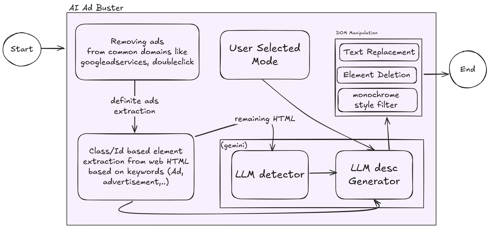

# Ad Content Transformer Chrome Extension

## Introduction

The Ad Content Transformer is a powerful Chrome extension that detects and transforms ad content on web pages. It uses advanced machine learning techniques to identify advertisements and offers multiple transformation modes to enhance your browsing experience.

## Features

- Automatic ad detection using class and id attributes
- Advanced ad detection using LLM (Language Model) API
- Multiple transformation modes:
  - Default: Replaces ads with related content
  - Vampire: Transforms ads into spooky, monochrome content
  - Exorcism: Completely removes ad elements from the page
- Real-time content transformation
- Easy-to-use popup interface for mode selection
- Customizable styling for transformed content

## Installation

1. Clone this repository or download the source code.
2. Open Google Chrome and navigate to `chrome://extensions`.
3. Enable "Developer mode" in the top right corner.
4. Click "Load unpacked" and select the directory containing the extension files.
5. The Ad Content Transformer extension should now appear in your extensions list.

## Usage

1. Click on the Ad Content Transformer icon in the Chrome toolbar to open the popup.
2. Use the toggle switch to enable or disable the extension.
3. Select a transformation mode from the dropdown menu:
   - Default: Replaces ads with related content
   - Vampire: Transforms ads into spooky, monochrome content
   - Exorcism: Completely removes ad elements
4. Browse websites as usual, and the extension will automatically detect and transform ad content based on your selected mode.

## API Setup

This extension requires a backend API to function properly. Follow these steps to set up the API:

1. Ensure you have Node.js installed on your system.
2. Navigate to the `api` directory in the project folder.
3. Install the required dependencies:

## Architectural Diagram

## Architecture

The Ad Content Transformer extension follows a multi-step process to detect, analyze, and transform ad content on web pages. Here's a detailed breakdown of the architecture:

0. **Blocking Specific Ad domain Urls**
    -Filtering and blocking all urls with domain googleadservices.com and doubleclick.net.

1. **Initial Ad Detection**
   - The extension first scans the webpage for elements with class names or IDs containing ad-related keywords (e.g., "ad", "sponsored", "promotion").
   - These elements are collected in an array for further processing.

2. **LLM-based Content Analysis**
   - After the initial detection, the extension extracts the remaining content from the webpage.
   - This content is sent to a Language Model (LLM) API for advanced ad detection.
   - The LLM analyzes the content and returns an array of text snippets it identifies as potential ads.

3. **Comprehensive Ad Collection**
   - The extension combines the results from the initial detection (step 1) and the LLM analysis (step 2) into a single array of ad elements.

4. **Content Transformation**
   - For each identified ad element, the extension generates a new description based on the selected theme (Default, Vampire, or Exorcism).
   - This transformation is done by sending the original ad content to the LLM API along with the current theme.
   - The LLM generates appropriate replacement content that fits the selected theme.

5. **Page Update**
   - The extension replaces the original ad content on the webpage with the newly generated, theme-appropriate content.
   - For elements detected in step 1, the entire element's innerHTML is replaced.
   - For content detected by the LLM in step 2, the specific text snippets are replaced inline.

6. **Styling Application**
   - Depending on the selected theme, the extension applies CSS styles to the transformed content:
     - Default: Subtle styling to blend with the page
     - Vampire: Monochrome filter and spooky styling
     - Exorcism: Hidden from view

7. **User Interface**
   - The extension provides a popup interface where users can:
     - Enable or disable the extension
     - Select the desired transformation theme
   - These settings are stored and can be changed in real-time, triggering a re-transformation of the page content.

### Component Interaction

- **Content Script (`content.js`)**: Runs on the webpage, performs the initial detection, and coordinates the transformation process.
- **Background Script (`background.js`)**: Handles communication with the LLM API and manages the extension's state.
- **Popup (`popup.html` and `popup.js`)**: Provides the user interface for controlling the extension.
- **Styles (`styles.css`)**: Defines the visual appearance of transformed content.

### API Integration

The extension communicates with a backend API that interfaces with the LLM. This API provides two main endpoints:
1. `/detect-irrelevant-content`: For advanced ad detection in step 2.
2. `/transform-ad-content`: For generating theme-appropriate replacement content in step 4.

This architecture allows for a flexible and powerful ad transformation system that combines rule-based detection with advanced machine learning techniques to provide a customized browsing experience.

## TechStack
1.Node Js (backend)
2.frontend (Html, css,Vanilla Js)
3.Generative AI (Google Gemini as LLM)
